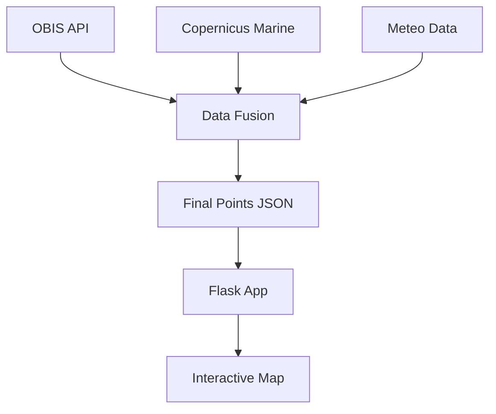

# BlueObserver - Marine Species Observation Platform

**A web-based visualization tool for marine species distribution with environmental data integration**

[](https://python.org)
[](https://flask.palletsprojects.com/)
[](LICENSE)
[](https://github.com/InesBahraoui22/BlueObserver)

## Overview

BlueObserver is an interactive web application that visualizes marine species observations combined with oceanographic data (temperature, waves, wind, rain). The platform allows researchers and marine enthusiasts to explore species distribution patterns across different regions and seasons.

**Key Features:**
-  **Interactive map** with D3.js visualization
-  **Species filtering** by region, month, and species type
-  **Environmental data** integration (Copernicus Marine Service)
-  **Detailed observation cards** with wave height classification




```bash
BlueObserver/
├── data/                               # Toutes les données (brutes, traitées, finales)
├── data_generation/                    # Scripts du pipeline de données
│   ├── import_donnees_obis.py          # Étape 1 : Récupération OBIS
│   ├── import_donnees_copernicus.py    # Étape 2 : Récupération Copernicus
│   ├── enrich_meteo_data.py            # Étape 3 : Enrichissement météo
│   ├── jointure.py                     # Étape 4 : Fusion finale
│   ├── fonctions_import_copernicus.py  # Fonctions helpers pour Copernicus
│   └── openmeteo_functions.py          # Fonctions helpers pour Open-Meteo
├── tests/                              # Tests unitaires pour chaque script
├── doc/                                # Documentation, présentations, roadmap
├── static/                             # Assets pour l'application web (CSS, JS, images)
├── templates/                          # Templates HTML pour l'application web
├── app.py                              # Application Flask principale
├── requirements.txt                    # Dépendances Python
└── README.md                           # Ce fichier
```

## Features in Detail

### Interactive Map
- **Points colored by water temperature** - Visual gradient from cool to warm waters
- **Zoom and pan functionality** - Explore different regions at various scales
- **Click points for detailed observations** - Get species information and environmental data

### Data Filtering
- **Region**: Mediterranean, North Atlantic, Atlantic North-East, Atlantic North-West, Atlantic Central
- **Month**: January through December for seasonal pattern analysis
- **Species**: Filter by common names (e.g., "Blue Whale") or scientific names (e.g., "Balaenoptera musculus")

### Wave Height Classification

| Height (m) | Class | Emoji | Description |
|------------|-------|-------|-------------|
| < 0.5 | Class 0 | 🟢 | Ideal conditions - Calm sea |
| 0.5 - 1 | Class 1 | 🟡 | Good visibility - Slight sea |
| 1 - 2 | Class 2 | 🟠 | Rough sea - Caution advised |
| 2 - 3 | Class 3 | 🔴 | Heavy sea - Difficult conditions |
| > 3 | Class 4 | ⚫ | Very heavy sea - Dangerous conditions |

## Authors

**Ines Bahraoui** 
**Chloé Monmont** 


## License

This project is licensed under the **MIT License** - see the [LICENSE](LICENSE) file for details.

## Acknowledgments

- **OBIS** (Ocean Biodiversity Information System) for species occurrence data
- **Copernicus Marine Service** for oceanographic data (temperature, waves)
- **D3.js** for interactive mapping visualization
- **Tailwind CSS** for modern, responsive design
- **Flask** for the lightweight web framework
- **GitHub** for project hosting and version control

## Related Resources

- [OBIS API Documentation](https://api.obis.org/) - Species occurrence data API
- [Copernicus Marine Toolbox](https://marine.copernicus.eu/) - Oceanographic data access
- [D3.js Gallery](https://observablehq.com/@d3/gallery) - Visualization examples
- [Flask Documentation](https://flask.palletsprojects.com/) - Web framework guide
- [GitHub Markdown Guide](https://docs.github.com/en/get-started/writing-on-github/getting-started-with-writing-and-formatting-on-github/basic-writing-and-formatting-syntax) - Formatting reference

  
## Getting Started

### Prerequisites
- Python 3.9 or higher
- Git
- (Optional) Conda for virtual environment management

### Installation


### 1. Cloning and moving
```bash
git clone https://github.com/InesBahraoui22/BlueObserver.git
cd BlueObserver
```

### 2. Dependencies installing
```bash
# Créer l'environnement
python -m venv venv

# Activer (Mac/Linux)
source venv/bin/activate

# Activer (Windows PowerShell)
.\venv\Scripts\Activate.ps1

# Installer tout
pip install -r requirements.txt
```

### 3. Launching the app
```bash
python app.py
```
 **Open** : [http://localhost:5000](http://localhost:5000)


## Development

### Data generation
```bash
# Moving into the data generating directory 
cd data_generation

# Creating the obis data
python import_donnes_obis.py

# Creating the copernicus data
python import_donnes_copernicus.py

# Creating the meteorological data
python points.json.py

# Fusing all the previously-cited data 
python finalpoints/jointure.py

# Verifying if the file has been generated
ls -lh ../data/final_points.json
```

### Relaunching the app
```bash
# Still with the environment activated
python app.py
# Click Ctrl+C to stop
```
### Access to the website

 **Open** : https://blueobserver.onrender.com/ 
