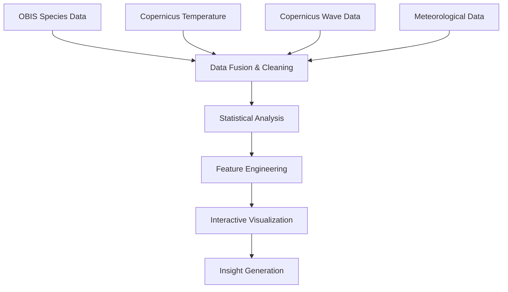

# 🌊 BlueObserver - Marine Species Observation Platform

**A web-based visualization tool for marine species distribution with environmental data integration**

[](https://python.org)
[](https://flask.palletsprojects.com/)
[](LICENSE)
[](https://github.com/InesBahraoui22/BlueObserver)

## 📋 Overview

BlueObserver is an interactive web application that visualizes marine species observations combined with oceanographic data (temperature, waves, wind, rain). The platform allows researchers and marine enthusiasts to explore species distribution patterns across different regions and seasons.

**Key Features:**
- 🗺️ **Interactive map** with D3.js visualization
- 🐋 **Species filtering** by region, month, and species type
- 📊 **Environmental data** integration (Copernicus Marine Service)
- 🔍 **Detailed observation cards** with wave height classification
- 📱 **Responsive design** for all devices


graph LR
    A[OBIS API] --> D[Data Fusion]
    B[Copernicus Marine] --> D
    C[Meteo Data] --> D
    D --> E[Final Points JSON]
    E --> F[Flask App]
    F --> G[Interactive Map]


BlueObserver/
├── app.py                      # Flask application
├── requirements.txt            # Python dependencies
├── LICENSE                     # MIT License
├── README.md                   # This file
├── finalpoints/
│   ├── jointure.py            # Data fusion script
│   └── final_points.json      # Processed observation data
├── tests/                      # Unit tests
│   ├── test_jointure.py
│   └── test_copernicus_extraction.py
├── static/
│   ├── css/                   # Stylesheets
│   ├── js/                    # JavaScript files
│   └── photos/                # Species images
├── templates/
│   ├── index.html             # Main page
│   └── about.html             # About page
└── especes/                   # Species data files
    └── nomsespecefin.csv      # Species name mapping


## 📊 Features in Detail

### Interactive Map
- **Points colored by water temperature** - Visual gradient from cool to warm waters
- **Zoom and pan functionality** - Explore different regions at various scales
- **Click points for detailed observations** - Get species information and environmental data

### Data Filtering
- **Region**: Mediterranean, North Atlantic, Atlantic North-East, Atlantic North-West, Atlantic Central
- **Month**: January through December for seasonal pattern analysis
- **Species**: Filter by common names (e.g., "Blue Whale") or scientific names (e.g., "Balaenoptera musculus")

### Wave Height Classification

| Height (m) | Class | Emoji | Description |
|------------|-------|-------|-------------|
| < 0.5 | Class 0 | 🟢 | Ideal conditions - Calm sea |
| 0.5 - 1 | Class 1 | 🟡 | Good visibility - Slight sea |
| 1 - 2 | Class 2 | 🟠 | Rough sea - Caution advised |
| 2 - 3 | Class 3 | 🔴 | Heavy sea - Difficult conditions |
| > 3 | Class 4 | ⚫ | Very heavy sea - Dangerous conditions |

## 👤 Author

**Ines Bahraoui** - Master 1 Oceanography Student

- **GitHub**: [@InesBahraoui22](https://github.com/InesBahraoui22)
- **Project Repository**: [BlueObserver](https://github.com/InesBahraoui22/BlueObserver)
- **Academic Context**: M1 Project in Oceanography and Marine Data Science

## 📄 License

This project is licensed under the **MIT License** - see the [LICENSE](LICENSE) file for details.

## 🙏 Acknowledgments

- **OBIS** (Ocean Biodiversity Information System) for species occurrence data
- **Copernicus Marine Service** for oceanographic data (temperature, waves)
- **D3.js** for interactive mapping visualization
- **Tailwind CSS** for modern, responsive design
- **Flask** for the lightweight web framework
- **GitHub** for project hosting and version control

## 📚 Related Resources

- [OBIS API Documentation](https://api.obis.org/) - Species occurrence data API
- [Copernicus Marine Toolbox](https://marine.copernicus.eu/) - Oceanographic data access
- [D3.js Gallery](https://observablehq.com/@d3/gallery) - Visualization examples
- [Flask Documentation](https://flask.palletsprojects.com/) - Web framework guide
- [GitHub Markdown Guide](https://docs.github.com/en/get-started/writing-on-github/getting-started-with-writing-and-formatting-on-github/basic-writing-and-formatting-syntax) - Formatting reference

  
## 🚀 Getting Started

### Prerequisites
- Python 3.9 or higher
- Git
- (Optional) Conda for virtual environment management

### Installation


### 1. Cloner et se déplacer
```bash
git clone https://github.com/InesBahraoui22/BlueObserver.git
cd BlueObserver
```

### 2. Installer les dépendances
```bash
# Créer l'environnement
python -m venv venv

# Activer (Mac/Linux)
source venv/bin/activate

# Activer (Windows PowerShell)
.\venv\Scripts\Activate.ps1

# Installer tout
pip install -r requirements.txt
```

### 3. Lancer l'application
```bash
python app.py
```
📍 **Ouvrir** : [http://localhost:5000](http://localhost:5000)

### 4. Tester (optionnel)
```bash
# Vérifier que tout marche
python tests/test_jointure.py --quick

# Lancer tous les tests
python -m pytest tests/ -v
```

## 🔧 Développement

### Générer les données
```bash
# Exécuter le script de fusion
python finalpoints/jointure.py

# Vérifier le fichier généré
ls -lh finalpoints/final_points.json
```

### Redémarrer l'application
```bash
# Toujours avec l'environnement activé
python app.py
# Appuyer sur Ctrl+C pour arrêter
```
Ines BAHRAOUI — 21901184
